# Overview

This repository contains detailed information on our IEEE RA-L paper entitled "***AV4GAINsp***: An Efficient Dual-Camera System for Identifying Defective Kernels of Cereal Grains".


# Code

## Train
All codes are stored in `src` folder, and the detailed train and test scripts can be found in the corresponding sub-folder **README.md**:
- recognition (The recognition code of our proposed three-stage framework, thanks for [TASN](https://github.com/researchmm/tasn) providing the trilinear attention code)
- mmdetection (Faster RCNN, YoloX, Mask RCNN, RTMDet)
- SAM

## Evaluate
Please read `src/eval/README.md`.


## Data

- For single-kernel images, the dataset (processed oriented and single-kernel images) can be found (below).


- For raw images, we have provided XML files in VOC format and JSON files in COCO format. It should be noted that the XML file corresponds to annotations for a single image, while the JSON file corresponds to annotations for two sides combined.You can also convert XML files to JSON files through `parsexml.py` and `makecoco.py`.
  - [raw-wheat(10.2G)](https://doi.org/10.6084/m9.figshare.24416965.v1)
  - [raw-sorghum(7.1G)](https://doi.org/10.6084/m9.figshare.24416932.v1)
  - [raw-rice(6.8G)](https://doi.org/10.6084/m9.figshare.24417526.v1)

## Pre-trained models

- Recognition: [google drive (450M)](https://drive.google.com/drive/folders/1r09p1oy1DqmJ-7J7Clpmm7FeK5UZiOQ0?usp=sharing) including training checkpoints.
- Faster R-CNN: [google drive (960M)](https://drive.google.com/drive/folders/1rx3wcZEFFJnByOwvliVmhPY4Mz1_0aja?usp=share_link) including training checkpoints.
- YoloX: [google drive (870M)](https://drive.google.com/drive/folders/1xIfecTlboBr76PZfguLS3qWIPm2o5EM2?usp=sharing) including training checkpoints.
- Mask R-CNN: [google drive (1G)](https://drive.google.com/drive/folders/1WHjB9GE8QIPQ-vDA4NPcsex8vu3gjoPK?usp=share_link) including training checkpoints.
- RTMDet: [google drive (1.2G)](https://drive.google.com/drive/folders/1y-dpm_C_Rh6tYFw2XLPNAqzVC6M5dx_i?usp=sharing) including training checkpoints.
- SAM: [google drive (1.G)](https://drive.google.com/drive/folders/1eVu0y_I_TMUM_y9WjguwOUlWKL3Z2WTg?usp=sharing) including training checkpoints.


# Data Acquisition

## Overview

 

- **Sample Collection**
  - Crops are harvested and transported into the grain centers
  - Raw grains are sampled to extract laboratory samples
  - Laboratory samples are further pre-processed by using handed tools, such as sieves, fans, tweezers
- **Image Acquisition**
  - Grain kernels are fed into our device
  - Our framework can produce a number of single-kernel images
- **Image Annotation** (***during using our device, this stage is replaced by our Recognition model***)
  - single-kernel images are annotated by six human experts


## Acquisition Phase

<!-- 
|       | Feeding  |  Transporting |  Capturing | Recycling|
| ----- | ----------- | ------------ | ------------ | ------------------------- |
|Paper |  |  |   |   |
|GIF|  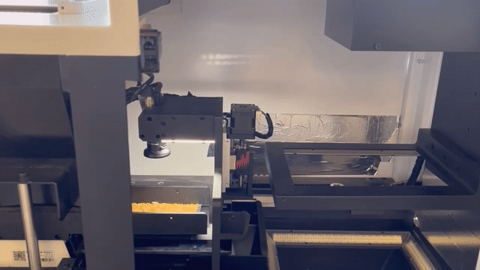 |   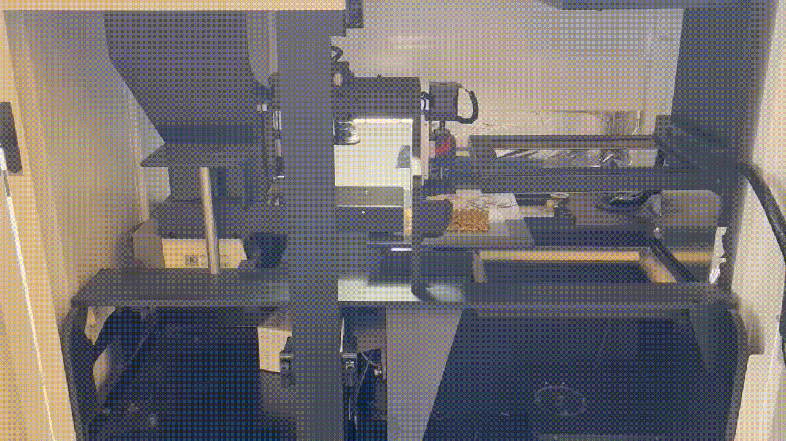  |    |    |  
-->

|       | Feeding  |  Transporting |  Capturing | Recycling|
| ------------------------ | --------------------------- | ------------ | ------------ | ------------------------- |
|Paper |  |   |   |    |
|GIF|      |       |    |     |  


<!-- 
## Video for Acquisition Phase
$ A complete data acquisition for a laboratory samples YouTube.
--> 


## Image Data Analysis and Annotations

 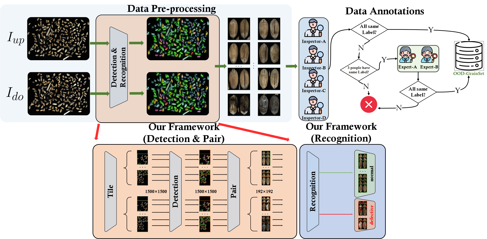

### Our Analysis Framework
- $I_{up}$ and $I_{do}$ are fed into our three-stage framework
  - 1, $I_{up}$ and $I_{do}$ are tiled into 15 overlapping patches, with each patch having 1500$\times$1500 pixels.
  - 2, Two raw images can produce a total of 30 patches
- **Stage-Detection**: 
  - 1, Each patch is fed into an object detection model ($\phi_{d}$, YoloX only doing detection without classification) to detect all kernel images
  - 2, All patches from $I_{up}$ can obtain $M_{up}$ kernel images that are saved into **UPDetRes** 
  - 3, All patches from $I_{do}$ can obtain $M_{do}$ kernel images that are saved into **DoDetRes** 
- **Stage-Pair**:
  - All kernels in **UPDetRes** and **DoDetRes** are paired according to their centroid position and spatial distance, obtaining $M=\max(M_{up},M_{do})$ single-kernel images, with each single-kernel image has two views 
-  **Stage-Recognition**:
   -  1, Two views in a single-kernel images are horizontally merged into an image
   -  2, Image is fed into the classification model ($\phi_{c}$, ResNet with imbalanced losses)


### Image Data Annotations

- We employ our framework (stage: detection and pair) to generate a vast number of candidate single-kernel images, and these images are used for building high-quality dataset: **GrainDet**.
- we have engaged a team of six experienced annotators: 
    - 1) Four senior inspectors with 5-10 years of inspection experience and currently working in authoritative quality inspection centers; 
    - 2) Two experts with over 10 years of experience and holding leadership positions in the quality inspection center, who are also involved in the development of several national standards related to cereal grains.  
- The annotation for each kernel involves multiple steps to ensure consistency and accuracy:
   - 1) If all 4 senior inspectors assign the same label, then the label is confirmed (more than 99.9% of kernels are annotated in this step);
   - 2) In case where 3 of 4 senior inspectors assign the same label, then two experts are consulted to reach a final agreement and confirm the label;
   - 3) The remaining images are discarded.
 -  **To maintain the high quality of our dataset, we exclusively include samples from step1 and step2 samples in our GrainDet.**


 
# Dataset: *GrainDet*


Our dataset, called **GrainDet**, involves three types of cereal grains: wheat, rice and sorghum. 

- For wheat data, we annotated about $80K$ single-kernel images, including $48K$ normal grains and $32K$ images for six types of defective grains and impurities.
- For rice data, we annotated about $24K$ single-kernel images, including $15K$ normal grains and $9K$ images for six types of defective grains and impurities.
- For sorghum data, we annotated about $40K$ single-kernel images, including $24K$ normal grains and $16K$ images for six types of defective grains and impurities..

## Category Abbreviation

|Species| Category| Abbreviation|
|----|-----|------|
|Wheat, Rice, Sorghum| Normal grains| NOR|
|Wheat, Rice, Sorghum| Sprouted grains| SD|
|Wheat, Rice, Sorghum| Fusarium & Shrivele grains| F&S|
|Wheat, Rice, Sorghum| Broken grains| BN|
|Wheat, Rice, Sorghum| Grains attacked by pests| AP|
|Wheat, Rice, Sorghum| Impurities| IM|
|**Wheat**| Black point grains| BP|
|**Rice**| Unripe grains| UN|
|**Sorghum**| Heated grains| HD|


## Examples

<!-- 
|       | NOR(normal) | SD(sprouted) | FS(fusarium) | BP (black point for wheat)/HD (heated for sorghum)/ UN(unripe for rice) | MY(moldy) | BN(broken) | AP(attacked by pests) | IM (impurities) |
| ----- | ----------- | ------------ | ------------ | ------------------------- | --------- | ---------- | --------------------- | --------------- | 
| Wheat |  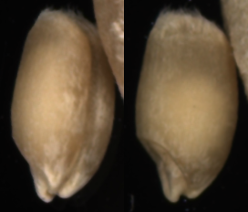   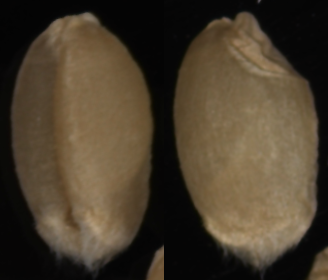      | 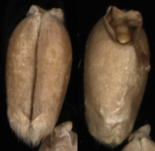   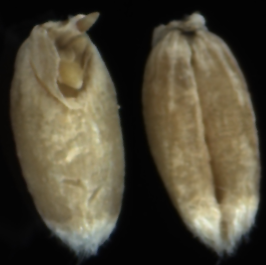| 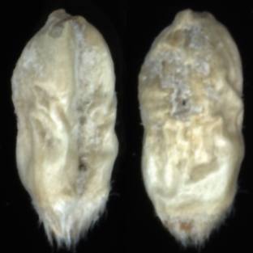   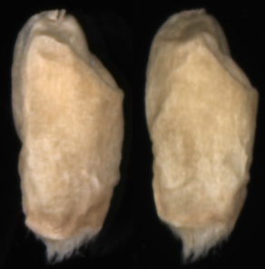                    | 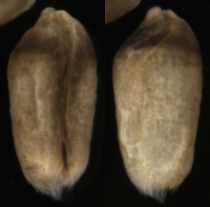   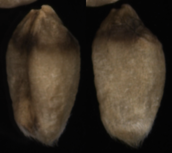                           | 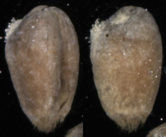   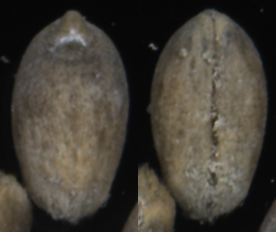        | 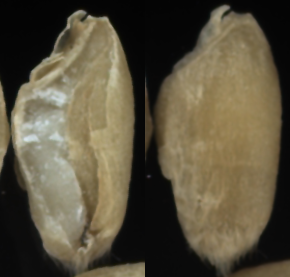   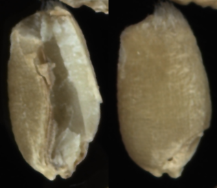         | 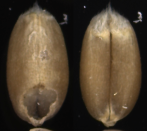   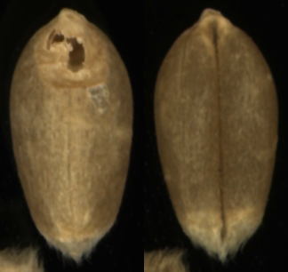                    | 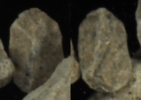   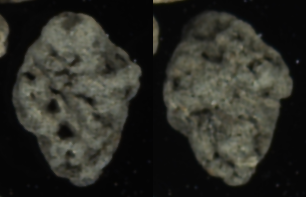              | 
| Rice | 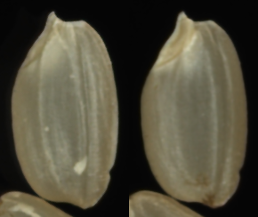   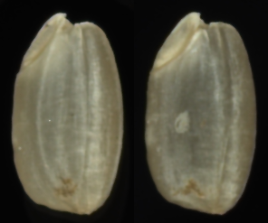      | 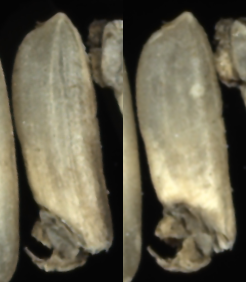   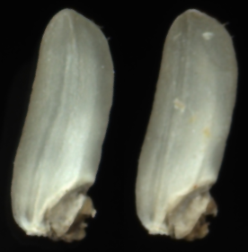| 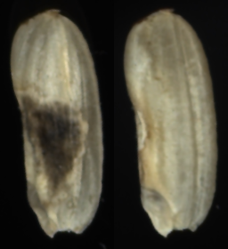   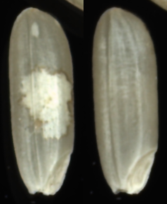                    | 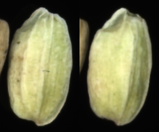   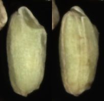                           | 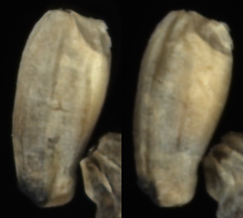   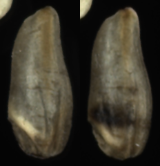        | 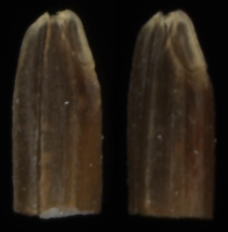   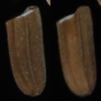         | 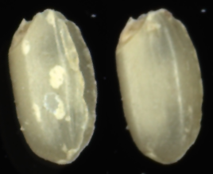   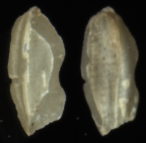                    | 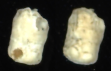   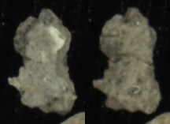              | 
| Sorghum | 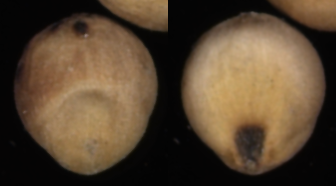   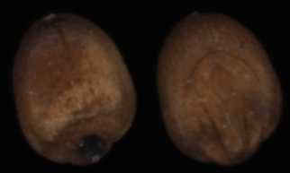      | 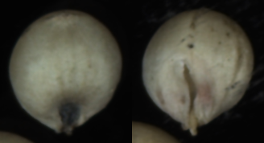   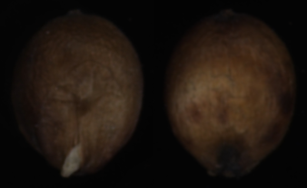| 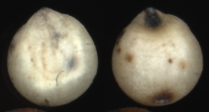   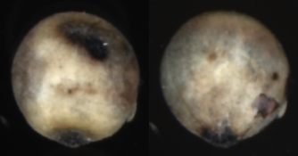                    | 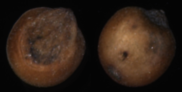   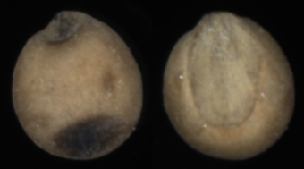                           | 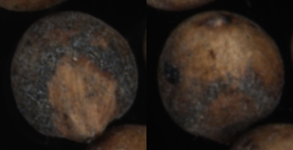   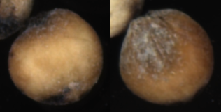        | 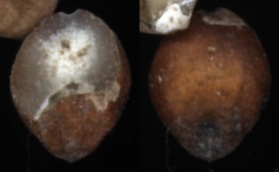   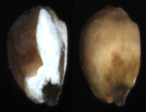         |    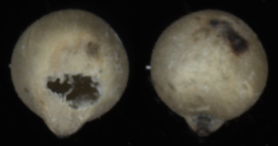                    | 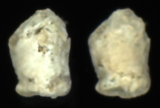   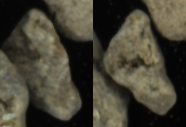              | 
-->

|       | NOR | SD | FS | BP/HD/UN| MY| BN | AP| IM|
| ----- | ----------- | ------------ | ------------ | ------------------- | --------- | ---------- | --------------------- | --------------- | 
| Wheat |       |       |         |                    |         |           |                     |        | 
| Rice |       |       |         |                    |         |           |                     |        | 
| Sorghum |       |       |         |                    |         |           |                     |        | 


## Data distribution of defective kernels

|       | NOR | SD | FS | BP/HD/UN| MY| BN | AP| IM | Total |
| ----- | ----------- | ------------ | ------------ | ---------------------------- | --------- | ---------- | --------------------- | --------------- | ----- |
| Wheat | 48.1K        | 5.1k           | 5.1k           | 1.4k                           | 5.2k        | 5.8k         | 5.2k                    | 4k              | 80K  |
| Rice | 16k         | 1.1k           | 1.2k           | 1.2k                           | 1.2k        | 1.2k         | 1.2k                    | 1.6k              | 24.7K   |
| Sorghum | 24k         | 3.6k           | 1.4k           | 0.2k                           | 3.6k        | 3.6k         | 3.6k                    | 1.2k              | 41K   |


## Access the *GrainDet*

#### Wheat Images
-  [GrainDet-Wheat (80k, 7.6GB)](https://figshare.com/articles/figure/_RA-L_wheat_zip/23686551), including three folders: train (56K) / val (8K) / test (16K)

#### Rice Images 
- [GrainDet-Rice (24.7k, 1.7GB)](https://figshare.com/articles/figure/rice_zip/23686368), including three folders: train (17K) / val (2.3K) / test (4.9K)
  
#### Sorghum Images 
- [GrainDet-Sorghum (41k, 2.4GB)](https://figshare.com/articles/figure/sorg_zip/23686419), including three folders: train (28.8K) / val (4K) / test (8K)


# *AV4GAInsp vs. Human Experts* Experiments

## Calc_kappa.py Script

The script is used for obtaining the confusion matrix and kappa statistics.

```
calc_kappa.py
```


## Access the Images for Kappa Tests 

- [GrainDet-Wheat-Kappa test (12k, 1.2GB)](https://figshare.com/articles/figure/Kappa-Wheat_zip/23684658), including three folders: train (28.8K) / val (4K) / test (8K)


## Detailed confusion matrixes between Devices and Human Experts

| SampleID    	| $S_1$  	|  $S_1$    	| $S_2$  	|  $S_2$    	| $S_3$  	|   $S_3$  	|
|-----	|-----	|-----	|-----	|-----	|-----	|-----	|
|  **DeviceID**   	| $D_1$ 	| $D_2$ 	| $D_1$ 	| $D_2$ 	| $D_1$ 	| $D_2$ 	|
| $J_1$ 	|  Kappa_0.970    	| Kappa_0.902    	| Kappa_0.952     	| Kappa_0.907     	|  Kappa_0.960     	|   Kappa_0.949   	|
| $J_2$ 	|  Kappa_0.970    	| Kappa_0.930    	|  Kappa_0.952     	|Kappa_0.915      	|   Kappa_0.971   	| Kappa_0.949     	|
|  **SampleID**   	| $S_4$  	|  $S_4$    	| $S_5$  	|  $S_5$    	| $S_6$  	|   $S_6$  	|
|  **DeviceID**   	| $D_1$ 	| $D_2$ 	| $D_1$ 	| $D_2$ 	| $D_1$ 	| $D_2$ 	|
| $J_1$ 	|  Kappa_0.949    	| Kappa_0.913    	| Kappa_0.925     	| Kappa_0.902     	|  Kappa_0.895     	|   Kappa_0.867   	|
| $J_2$ 	|  Kappa_0.953   	| Kappa_0.921    	|  Kappa_0.937    	|Kappa_0.908      	|   Kappa_0.904   	| Kappa_0.878     	|
